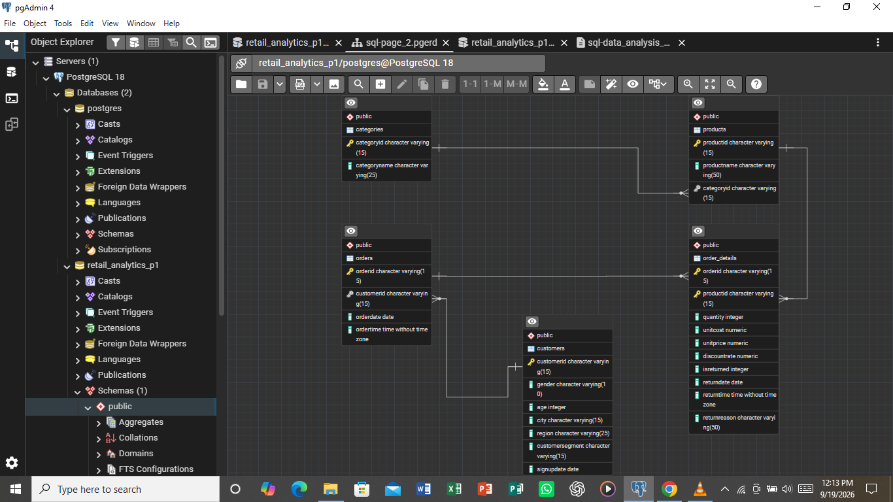

# Retail Sales & Customer Analytics with PostgreSQL

##  Project Overview  

**Project Title:** Retail Sales & Customer Analytics  
**Database:** `retail_analytics_p1`

This project demonstrates the Retail Sales and Customer Analytics using SQL. It includes relational database design, data exploration, data quality checks, data cleaning, and SQL-based business analysis. The goal is to showcase skills in database design, manipulation, and querying.


## Objectives

1. Create and structure the PostgreSQL database: Design the tables, Define the appropiate data types, primary keys, and foreign key relationships.
2. Data Exploration & Quality checks: Explore the data and inspect the data quality to see if there is any data to clean.
3. Data Cleaning: Perform a detailed data cleaning for any data quality issue found.
4. Validate the database and cleaned data: Verify the relationships, data consistency, and the results of the cleaning process.
5. Perform SQL-based business analysis: Use queries, joins, aggregations, subqueries, CTEs, and window functions to answer business questions and generate insights.

## Project Structure

### 1.Database Setup



- **Database Creation**: Created a database named `retail_analytics_p1` .
- **Table Creation**: Created tables for categories, customers, order_details, orders, and products. Each table includes relevant columns and relationships.

```sql
CREATE DATABASE retail_analytics_p1;

-- create table "categories"
CREATE TABLE categories
(
		    CategoryID VARCHAR(15) PRIMARY KEY,
		    CategoryName VARCHAR(25)
);


-- create table "products"
CREATE TABLE products
(	
            ProductID VARCHAR (15) PRIMARY KEY, 
		    ProductName	VARCHAR (50),
		    CategoryID VARCHAR (15)
            FOREIGN KEY (categoryid) REFERENCES categories (categoryid)
);


-- create table "customers"
CREATE TABLE customers
(	
		    CustomerID VARCHAR (15) PRIMARY KEY,
		    Gender VARCHAR (10),	
		    Age	INT,
		    City VARCHAR (15),	
		    Region VARCHAR (25),
		    CustomerSegment	VARCHAR (15),
		    SignUpDate DATE
);


-- create table "orders"
CREATE TABLE orders
(	
		    OrderID VARCHAR (15) PRIMARY KEY, 
		    CustomerID VARCHAR (15),  
		    OrderDate DATE,	
		    OrderTime TIME
            FOREIGN KEY (customerid) REFERENCES customers (customerid)
);


-- create table "order_details"
CREATE TABLE order_details
(	
		    OrderID VARCHAR (15), 
		    ProductID VARCHAR (15), 
		    Quantity INT,	
		    UnitCost NUMERIC, 	
		    UnitPrice NUMERIC,	
		    DiscountRate NUMERIC,	
		    IsReturned INT,	
		    ReturnDate DATE,	
		    ReturnTime TIME,	
		    ReturnReason VARCHAR (50),
		
		    PRIMARY KEY (OrderID, ProductID)
            FOREIGN KEY (orderid) REFERENCES orders (orderid),
            FOREIGN KEY (productid) REFERENCES products (productid)
);

```

### 2. Data Exploration & Quality checks

**Row counts**

```sql
SELECT	COUNT (*) 
FROM 	categories;

SELECT	COUNT (*) 
FROM 	customers;

SELECT	COUNT (*) 
FROM 	order_details;

SELECT	COUNT (*) 
FROM 	orders;

SELECT	COUNT (*) 
FROM 	products;
```

**NULL values**
```sql
SELECT * FROM categories
WHERE 
	categoryid IS NULL 
	OR
	categoryname IS NULL;

SELECT * FROM customers 
WHERE
	customerid IS NULL
	OR
	gender IS NULL
	OR
	age IS NULL
	OR
	city IS NULL
	OR
	region IS NULL
	OR
	customersegment IS NULL
	OR
	signupdate IS NULL;

SELECT * FROM order_details
WHERE 
	orderid IS NULL
	OR
	productid IS NULL
	OR
	quantity IS NULL
	OR
	unitcost IS NULL
	OR
	unitprice IS NULL
	OR
	discountrate IS NULL
	OR 
	isreturned IS NULL
	OR
	returndate IS NULL
	OR 
	returntime IS NULL
	OR
	returnreason IS NULL;

SELECT * FROM orders
WHERE 
	orderid IS NULL
	OR
	customerid IS NULL
	OR
	orderdate IS NULL
	OR
	ordertime IS NULL;

SELECT * FROM products
WHERE
	productid IS NULL
	OR
	productname IS NULL
	OR
	categoryid IS NULL;
```

**Duplicates**
```sql
SELECT categoryid,
	COUNT(*)
FROM categories
GROUP BY categoryid
HAVING COUNT (*) > 1;

SELECT customerid,
	COUNT(*)
FROM customers
GROUP BY customerid
HAVING COUNT (*) > 1;

SELECT orderid, productid,
	COUNT(*)
FROM order_details
GROUP BY orderid, productid
HAVING COUNT (*) > 1;

SELECT orderid,
	COUNT(*)
FROM orders
GROUP BY orderid
HAVING COUNT (*) > 1;

SELECT productid,
	COUNT(*)
FROM products
GROUP BY productid
HAVING COUNT (*) > 1;
```

**Invalid date values**
```sql
SELECT
	MIN(signupdate) as earliest_date,
	MAX(signupdate) as latest_date
FROM customers;

SELECT
	MIN(returndate) as earliest_date,
	MAX(returndate) as latest_date 
FROM order_details;

SELECT
	MIN(orderdate),
	MAX(orderdate)
FROM orders;
```

**Invalid time values**
```sql
SELECT 
	MIN(returntime) as shortest_time,
	MAX(returntime) as longest_time
FROM order_details; 
```

### 3. Data Cleaning

```sql
SELECT
	returndate,
	isreturned,
	COUNT(*) as records
	FROM order_details
	GROUP BY 1, 2
	ORDER BY 1 DESC;

SELECT * 
FROM order_details
WHERE 
	returndate = '9999-12-31'
	AND 
	returntime = '00:00:00'
LIMIT 20;

UPDATE order_details
SET returndate = 	NULL 
WHERE 
	returndate = '9999-12-31'
	AND
	isreturned = 0;

SELECT 
	returntime,
	isreturned,
	COUNT(*) as records
	FROM order_details
	GROUP BY 1, 2
	ORDER BY 1 ASC;

SELECT *
FROM order_details
WHERE
	returntime = '00:00:00'
	AND
	isreturned = 0
	LIMIT 20;

UPDATE order_details
SET returntime = NULL 
WHERE 
	returntime = '00:00:00'
	AND
	isreturned = 0
```

 ### 4. Validate the database and cleaned data

```sql
SELECT COUNT (*)
FROM order_details
WHERE returndate = '9999-12-31';

SELECT COUNT (*)
FROM order_details
WHERE returntime = '00:00:00';

SELECT COUNT (*)
FROM order_details
WHERE isreturned = 0
	AND 
	returndate IS NOT NULL;

SELECT COUNT (*)
FROM order_details
WHERE 
	isreturned = 0
	AND 
	returntime IS NOT NULL;
```

### 5. Perform SQL-based business analysis

**Q.1: What are the different customer segments in the customers table, and how many customers belong to each segment?**

```sql
SELECT 
	customersegment,
	COUNT (*) as customer_count
FROM customers
GROUP BY 1
ORDER BY 2 DESC;
```

**Q.2: Find all customers whose city contains the word "stan"**

```sql
SELECT * 
FROM customers
WHERE city ILIKE '%stan%';
```

**Q.3: Which cities have more than one customer?**

```sql
SELECT
	city,
	COUNT (*) as customer_count
FROM customers
GROUP BY 1
HAVING COUNT (*) > 1
ORDER BY 2 DESC;
```

**Q.4: How many products are there in each product category?**

```sql
SELECT 
	categoryid,
	COUNT(*) as product_count
FROM products
GROUP BY 1
ORDER BY 2 DESC;
```

**Q.5: What are the minimum, maximum, and average product prices?**

```sql
SELECT 
	MIN(unitprice) as minimum_price,
	MAX(unitprice) as maximum_price,
	ROUND(AVG(unitprice), 2) as avg_price
FROM order_details;
```

**Q.6:  Which products have a price greater than 10?**

```sql
SELECT productid
FROM order_details
WHERE unitprice > 10;
```

**Q.7: How many orders were placed on each order date?**

```sql
SELECT 
	orderdate,
	COUNT(*) as total_orders
FROM orders
GROUP BY 1
ORDER BY 1;
```

**Q.8: What is the earliest and latest order date in the dataset?**

```sql
SELECT 
	MIN(orderdate) as earliest_date,
	MAX(orderdate) as latest_date
FROM orders;
```

**Q.9: What are the minimum, maximum, and average quantities ordered?**

```sql
SELECT 
	MIN(quantity) as min_qty_ordered,
	MAX(quantity) as max_qty_ordered,
	ROUND(AVG(quantity), 2) as avg_qty_orderd
FROM order_details;
```

**Q.10: How many order-detail records are marked as returned versus not returned?**

```sql
SELECT 
	isreturned,
	COUNT(*) as record_count
FROM order_details
GROUP BY 1
ORDER BY 1;
```

**Q.11: List each product together with its category name**

```sql
SELECT 
	p.productid,
	p.productname,
	c.categoryname
FROM products as p
JOIN categories as c
ON c.categoryid = p.categoryid;
```

**Q.12: For each order, show the order ID, customer ID, city, region, and customer segment**

```sql
SELECT 
	o.orderid,
	o.customerid,
	cs.city,
	cs.region,
	cs.customersegment
FROM orders as o
JOIN customers as cs
ON o.customerid = cs.customerid;
```

**Q.13: For each product, show its product name, category name, and the total quantity sold***

```sql
SELECT 
	p.productid,
	p.productname,
	c.categoryname,
	SUM(od.quantity) as total_quantiy
FROM products as p
JOIN categories as c
ON p.categoryid = c.categoryid
JOIN order_details as od
ON p.productid = od.productid
GROUP BY 1, 2, 3;
```

**Q.14: List all customers and show the number of orders each customer has placed**

```sql
SELECT 
	cs.customerid,
	cs.city,
	cs.region,
	cs.customersegment,
	COUNT(o.orderid) as total_orders
FROM customers as cs
LEFT JOIN orders as o
ON cs.customerid = o.customerid
GROUP BY 1, 2, 3, 4
ORDER BY 5 DESC;
```

**Q.15: Which products have a price higher than the average price of all products?**

```sql
SELECT DISTINCT
	p.productid,
	p.productname,
	od.unitprice
FROM products as p
JOIN order_details as od
ON p.productid = od.productid
WHERE od.unitprice > (SELECT AVG(unitprice) FROM order_details)
ORDER BY 3 DESC;
```

**Q.16: Which cities have more than one customer who signed up 
within the last 180 days of the latest signup date?**

```sql
SELECT 
	city,
	COUNT(customerid) as total_customers
FROM customers
	WHERE signupdate >= (SELECT MAX(signupdate) - INTERVAL '180 days' FROM customers)
GROUP BY 1
HAVING COUNT (customerid) > 1
ORDER BY 2 DESC;
```

**Q.17: How many orders were placed in each year?**

```sql
SELECT 
	EXTRACT (YEAR FROM orderdate) as order_year,
	COUNT (*) as total_orders
FROM orders
GROUP BY 1
ORDER BY 1;
```

**Q.18: Rank products from highest to lowest based on the total quantity sold**

```sql
SELECT 
	p.productid,
	p.productname,
	SUM(od.quantity) as total_quantity_sold,
	RANK() OVER (ORDER BY SUM(od.quantity) DESC) as rank
FROM products as p
JOIN order_details as od
ON p.productid = od.productid
GROUP BY 1, 2
ORDER BY rank;
```

**Q.19: Which customers have placed more than five orders?**

```sql
WITH customer_orders
AS
(
SELECT 
	cs.customerid,
	cs.city,
	cs.region,
	cs.customersegment,
	COUNT(o.orderid) as order_count
	FROM customers as cs
	JOIN orders as o
	ON cs.customerid = o.customerid
GROUP BY 1, 2, 3, 4
)
SELECT 
	customerid,
	city,
	region,
	customersegment,
	order_count
FROM customer_orders
WHERE order_count > 5;
```

**Q.20: Using a subquery, identify customers who are from Aegean and have placed more than five orders**

```sql
SELECT 
	customerid, 
	region, 
	COUNT(orderid) as total_orders
FROM (
	SELECT 
		cs.customerid,
		cs.region, 
		o.orderid
    FROM customers as cs
    JOIN orders as o
        ON cs.customerid = o.customerid
) AS customer_orders
WHERE region = 'Aegean'
GROUP BY 
	customerid,
	region
HAVING COUNT(orderid) > 5
ORDER BY total_orders DESC;
```

## 🛠️ Technologies

- PostgreSQL
- SQL
- pgAdmin
- Git
- GitHub

## SQL Techniques Demonstrated

| Technique | Example use |
|---|---|
| `WHERE` / `ILIKE` | Filtering records and text search |
| `COUNT()` | Counting customers, products, and orders |
| `MIN()` / `MAX()` | Dates, prices, and quantities |
| `AVG()` | Average price and quantity |
| `GROUP BY` | Aggregating by customer, city, category, and date |
| `HAVING` | Filtering grouped results |
| `INNER JOIN` | Combining related tables |
| `LEFT JOIN` | Keeping all customers while counting orders |
| Subqueries | Average price and signup-date analysis |
| CTE | Customer order-count analysis |
| `EXTRACT()` | Orders by year |
| `RANK()` | Product ranking |
| `UPDATE` | Data cleaning |

## Reports

## Conclusion

This project demonstrates an end-to-end PostgreSQL workflow from relational database design through data-quality investigation, cleaning, validation, and business-oriented SQL analysis.


##  Get in touch!

**Name:** Dickson Gaetan Maketa  
**Email:** makettadickson@gmail.com  
**Phone:** +255 755 660 020


## 👤 Author 

**Dickson Maketa**

[GitHub Profile](https://github.com/maketadickson)


Thank you for your interest in this project!
